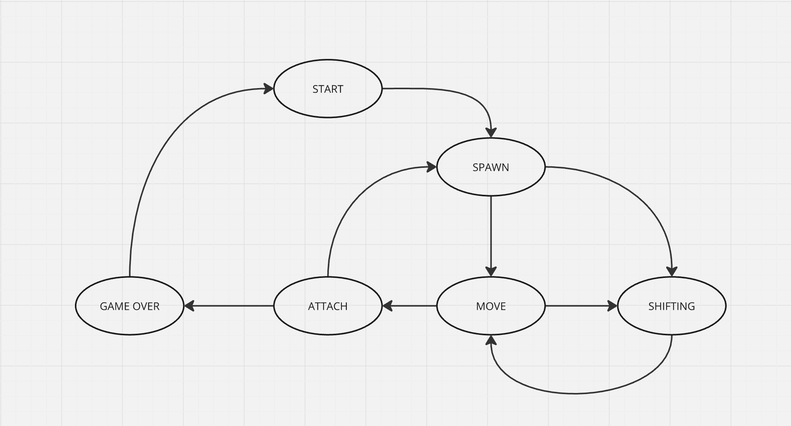

# BrickGame Tetris

Welcome to BrickGame Tetris! This is a classic implementation of the Tetris game developed in C using the `ncurses` library for the terminal interface. Below are the instructions on how to play the game.

## How to Play

### Directions

- **Start New Game:** Press `Enter`
- **End the Game:** Press `Q`
- **Pause the Game:** Press `Space`
- **Move Left:** Press the `Left Arrow`
- **Move Right:** Press the `Right Arrow`
- **Accelerate (Move Down Quickly):** Press the `Down Arrow`
- **Rotate the Piece:** Press `R`
- **Quit the Game:** Press `ESC`


### Scoring

- Clearing 1 row: 100 points
- Clearing 2 rows: 300 points
- Clearing 3 rows: 700 points
- Clearing 4 rows (Tetris): 1500 points

### Levels

- The game starts at level 1.
- Every time you score 600 points, the level increases by 1, and the speed of the falling pieces increases.
- The maximum level is 10.

### End of the Game

The game ends when a new piece cannot be placed at the top of the playing field, meaning the blocks have stacked too high. Your final score will be displayed, and if it’s higher than your previous best, it will be saved as the new high score.

### Tips

- **Plan ahead:** Keep an eye on the next piece that will appear and plan where to place it.
- **Leave room:** Try to leave open spaces for the long straight piece (I-shaped tetromino) to clear multiple lines at once.
- **Stay calm:** As the game speeds up, stay calm and make quick decisions to avoid stacking blocks too high.

Good luck, and enjoy the game!

## Controls Summary

| Action                | Key            |
|-----------------------|----------------|
| Start New Game        | `Enter`        |
| End the Game          | `Q`            |
| Pause the Game        | `Space`        |
| Move Left             | `Left Arrow`   |
| Move Right            | `Right Arrow`  |
| Accelerate (Move Down)| `Down Arrow`   |
| Rotate the Piece      | `R`            |
| Quit the Game         | `ESC`          |

## Installation and Running

To install and run the game, make sure you have the `ncurses` library.

```make install```


## Game logic (fsm):

> Finite-state machines for the game
